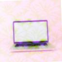
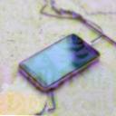
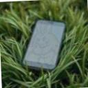
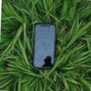
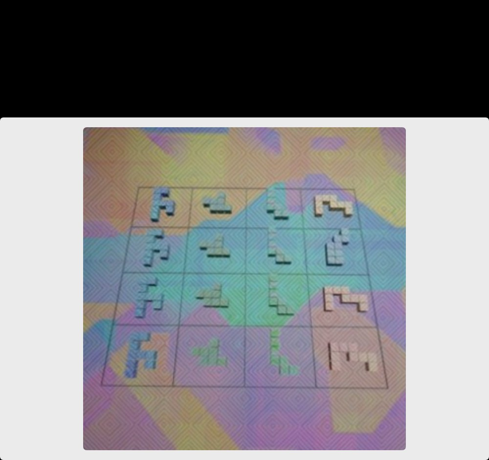

# HCaptchaClassification

同步识别 hCaptcha 图像挑战，支持九宫格选择、单图点击、拖拽，以及通过辅助图理解题意的挑战。

本文档以浏览器插件实际发送的数据为准。历史任务图片仅用于展示识别结果，不作为请求格式定义。

识别结果会在 `createTask` 响应中直接返回，不需要调用 `getTaskResult` 轮询。

## 创建任务

```http
POST https://api.1captcha.net/createTask
Content-Type: application/json
```

### 请求参数

#### Header 参数

| 参数 | 类型 | 必须 | 说明 |
| --- | --- | --- | --- |
| `Content-Type` | string | 是 | 固定为 `application/json`。 |

#### Body 参数

| 参数 | 类型 | 必须 | 说明 |
| --- | --- | --- | --- |
| `clientKey` | string | 是 | 插件配置中的账户密钥。 |
| `challengeId` | string | 条件必填 | 插件为当前挑战生成的 UUID，用于关联多道子任务和最终 `/report`。页面无法提供可跟踪的 hCaptcha widget ID 时可能不传，此时识别仍会执行，但不会上报验证结果。 |
| `callurl` | string | 是 | 插件读取的当前页面 URL。 |
| `task` | object | 是 | 识别任务。 |
| `task.type` | string | 是 | 固定为 `HCaptchaClassification`。 |
| `task.question` | string | 条件必填 | hCaptcha 显示的问题原文。没有 `anchors` 时必填。支持中文和英文。 |
| `task.queries` | string \| string[] | 是 | 九宫格传 9 个纯 PNG Base64 字符串；单图点击传一个 JPEG Data URL，动态画布可传一个 GIF Data URL。 |
| `task.anchors` | string[] | 否 | 插件从挑战头部裁剪出的提示图 Data URL 数组。九宫格请求会携带该字段，可能为空数组；单图请求仅在发现提示图时携带。 |

插件的图片编码规则如下：

- 九宫格查询图：按页面顺序绘制为 PNG，移除 `data:image/png;base64,` 前缀后放入数组。
- 单图静态画布：JPEG Data URL，默认质量为 0.88。
- 单图动态画布：GIF Data URL，保存插件采样的多个画面。
- 辅助提示图：裁剪后的 Data URL。

服务端同时兼容纯 Base64 和 Data URL。单张图片最大 15 MiB，所有查询图和辅助图解码后的总大小最大 15 MiB；完整 HTTP 请求体最大 20 MiB。

### 九宫格请求示例

`queries` 的顺序就是结果 `objects` 的顺序，下标从 0 开始。

```json
{
  "clientKey": "YOUR_API_KEY",
  "challengeId": "550e8400-e29b-41d4-a716-446655440000",
  "callurl": "https://example.com/login",
  "task": {
    "type": "HCaptchaClassification",
    "question": "请选择所有可以安全放入高温烤箱的物品",
    "queries": [
      "PNG_BASE64_IMAGE_0",
      "PNG_BASE64_IMAGE_1",
      "PNG_BASE64_IMAGE_2",
      "PNG_BASE64_IMAGE_3",
      "PNG_BASE64_IMAGE_4",
      "PNG_BASE64_IMAGE_5",
      "PNG_BASE64_IMAGE_6",
      "PNG_BASE64_IMAGE_7",
      "PNG_BASE64_IMAGE_8"
    ],
    "anchors": []
  }
}
```

### 单图点击请求示例

```json
{
  "clientKey": "YOUR_API_KEY",
  "challengeId": "550e8400-e29b-41d4-a716-446655440001",
  "callurl": "https://example.com/login",
  "task": {
    "type": "HCaptchaClassification",
    "question": "点击不符合规律的对象",
    "queries": "data:image/jpeg;base64,JPEG_BASE64_CANVAS_IMAGE"
  }
}
```

### 使用辅助图的请求示例

```json
{
  "clientKey": "YOUR_API_KEY",
  "challengeId": "550e8400-e29b-41d4-a716-446655440002",
  "callurl": "https://example.com/login",
  "task": {
    "type": "HCaptchaClassification",
    "question": "请选择与示例物体相同类型的图片",
    "queries": [
      "PNG_BASE64_IMAGE_0",
      "PNG_BASE64_IMAGE_1",
      "PNG_BASE64_IMAGE_2",
      "PNG_BASE64_IMAGE_3",
      "PNG_BASE64_IMAGE_4",
      "PNG_BASE64_IMAGE_5",
      "PNG_BASE64_IMAGE_6",
      "PNG_BASE64_IMAGE_7",
      "PNG_BASE64_IMAGE_8"
    ],
    "anchors": ["data:image/png;base64,PNG_BASE64_REFERENCE_IMAGE"]
  }
}
```

### cURL 示例

```bash
curl --location 'https://api.1captcha.net/createTask' \
  --header 'Content-Type: application/json' \
  --data '{
    "clientKey": "YOUR_API_KEY",
    "challengeId": "550e8400-e29b-41d4-a716-446655440001",
    "callurl": "https://example.com/login",
    "task": {
      "type": "HCaptchaClassification",
      "question": "点击不符合规律的对象",
      "queries": "data:image/jpeg;base64,JPEG_BASE64_CANVAS_IMAGE"
    }
  }'
```

## 真实识别样例

以下图片来自网关已经处理并收到挑战成功反馈的历史任务，只用于说明图片顺序与响应的对应关系。成功反馈表示整轮挑战已通过，但不等同于每个单独标签都经过人工审核。

### 九宫格样例

问题：`选出可安全放入高温烤箱的物品`

图片按 `queries` 数组下标排列：

| 0 | 1 | 2 |
| --- | --- | --- |
|  |  |  |
| **false** | **true** | **false** |
| 3 | 4 | 5 |
|  |  |  |
| **true** | **false** | **true** |
| 6 | 7 | 8 |
|  |  |  |
| **false** | **false** | **false** |

对应结果：

```json
{
  "solution": {
    "objects": [false, true, false, true, false, true, false, false, false]
  }
}
```

因此需要选择的图片下标是 `1`、`3`、`5`。

### 单图点击样例

问题：`点击不符合列规律的对象`



原图尺寸为 1000×940，对应结果：

```json
{
  "solution": {
    "box": ["686", "538"]
  }
}
```

需要点击的坐标是 `(686, 538)`，坐标原点位于图片左上角。

## 成功响应

HTTP 状态码为 `200`。`status` 固定为 `ready`。

### 九宫格选择

```json
{
  "errorId": 0,
  "errorCode": "",
  "errorDescription": "",
  "status": "ready",
  "taskId": "af3631d8-497c-4cc0-af2f-5fc42e2b19a9",
  "solution": {
    "objects": [false, true, false, true, false, true, false, false, false]
  }
}
```

`objects[i]` 对应 `queries[i]`。`true` 表示该图片符合问题要求，`false` 表示不符合。

### 单图点击

```json
{
  "errorId": 0,
  "errorCode": "",
  "errorDescription": "",
  "status": "ready",
  "taskId": "0bfacf4b-ba05-489c-9fc8-8fb6bc84cc9d",
  "solution": {
    "box": ["312", "535", "598", "552"]
  }
}
```

`box` 每两个元素组成一个 `[x, y]` 点击坐标，原点位于图片左上角。本例包含两个点击点：`[312, 535]` 和 `[598, 552]`。坐标基于上传原图尺寸。

### 拖拽

```json
{
  "errorId": 0,
  "errorCode": "",
  "errorDescription": "",
  "status": "ready",
  "taskId": "0bf790d4-fd8f-11ef-b9c0-b664f3107f10",
  "solution": {
    "box": [
      {
        "start": [644, 218],
        "end": [239, 315]
      }
    ]
  }
}
```

`start` 是拖拽物体的起点，`end` 是目标终点；多个目标按数组顺序逐一拖动。

### 响应字段

| 参数 | 类型 | 说明 |
| --- | --- | --- |
| `errorId` | integer | `0` 表示成功，`1` 表示失败。 |
| `errorCode` | string | 成功时为空字符串；失败时为错误代码。 |
| `errorDescription` | string | 成功时为空字符串；失败时为错误说明。 |
| `status` | string | 成功时为 `ready`。 |
| `taskId` | string | 本次识别任务的唯一 ID。 |
| `solution` | object | 识别结果。结构由挑战类型决定。 |
| `solution.objects` | boolean[] | 九宫格结果，固定 9 个布尔值。 |
| `solution.box` | string[] \| object[] | 点击坐标，或拖拽起止坐标。 |

## 失败响应

```json
{
  "errorId": 1,
  "errorCode": "ERROR_BAD_PARAMETERS",
  "errorDescription": "Invalid parameters"
}
```

接口可能使用 `400`、`401`、`413` 或 `500` 等 HTTP 状态码返回错误。

| errorCode | 说明 |
| --- | --- |
| `ERROR_KEY_DOES_NOT_EXIST` | 账户密钥缺失或无效。 |
| `ERROR_ZERO_POINT` | 账户点数不足。 |
| `ERROR_ACCOUNT_SUSPENDED` | 账户已暂停。 |
| `ERROR_TASK_NOT_SUPPORTED` | 任务类型不受支持。 |
| `ERROR_BAD_PARAMETERS` | 参数、Base64、图片数量或图片尺寸不符合要求。 |
| `ERROR_TOO_BIG_CAPTCHA_FILESIZE` | 请求体或图片数据过大。 |
| `ERROR_IMAGE_TYPE_NOT_SUPPORTED` | 图片格式不受支持或图片无法读取。 |
| `ERROR_CAPTCHA_UNSOLVABLE` | 未能识别验证码。 |
| `ERROR_INVOCATION_SERVICE` | 识别服务调用失败。 |
| `ERROR_NO_SLOT_AVAILABLE` | 服务繁忙，请稍后重试。 |

## 注意事项

- 本接口为同步接口，客户端超时时间建议设置为 60 秒以上。
- 九宫格必须提交 9 张图片；单图点击和拖拽只提交 1 张查询图。
- 图片顺序不得在请求后改变，否则 `objects` 将无法对应到正确图片。
- 动图会抽取部分关键帧用于识别，但返回坐标仍以原始单帧尺寸为准。
- 新问题类型可能无法识别，失败时会返回标准错误响应。
- 服务端也兼容 `X-Client-Key` 请求头，但插件实际使用请求体中的 `clientKey`。
